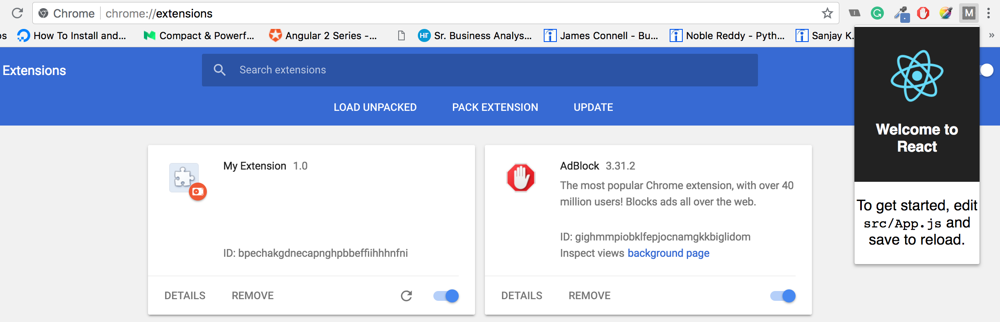
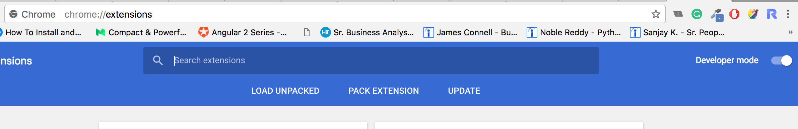

This project was bootstrapped with [Create React App](https://github.com/facebook/create-react-app).

## Available Scripts

In the project directory, you can run:

### `yarn install or npm install`
Install the node_modules

### `yarn start or npm run start`

Runs the app in the development mode. 
Open [http://localhost:3000](http://localhost:3000) to view it in the browser.

The page will reload if you make edits. 
You will also see any lint errors in the console.

### `yarn test or npm run test`

Launches the test runner in the interactive watch mode. 
See the section about [running tests](https://facebook.github.io/create-react-app/docs/running-tests) for more information.

### `yarn build or npm run build`

Builds the app for production to the `build` folder. 
It correctly bundles React in production mode and optimizes the build for the best performance.

The build is minified and the filenames include the hashes. 
Your app is ready to be deployed!

See the section about [deployment](https://facebook.github.io/create-react-app/docs/deployment) for more information.

### Deployment

1. Build the react code using `yarn build`
2. Make changes `manifest.json` as per your requirement.
3. In Chrome browser, go to chrome://extensions page and switch on developer mode. This enables the ability to locally install a Chrome extension.

4. Now click on the LOAD UNPACKED and browse to [PROJECT_HOME]/build ,This will install the React app as a Chrome extension.

5. When you click the extension icon, you will see the React app, rendered as a extension popup.
